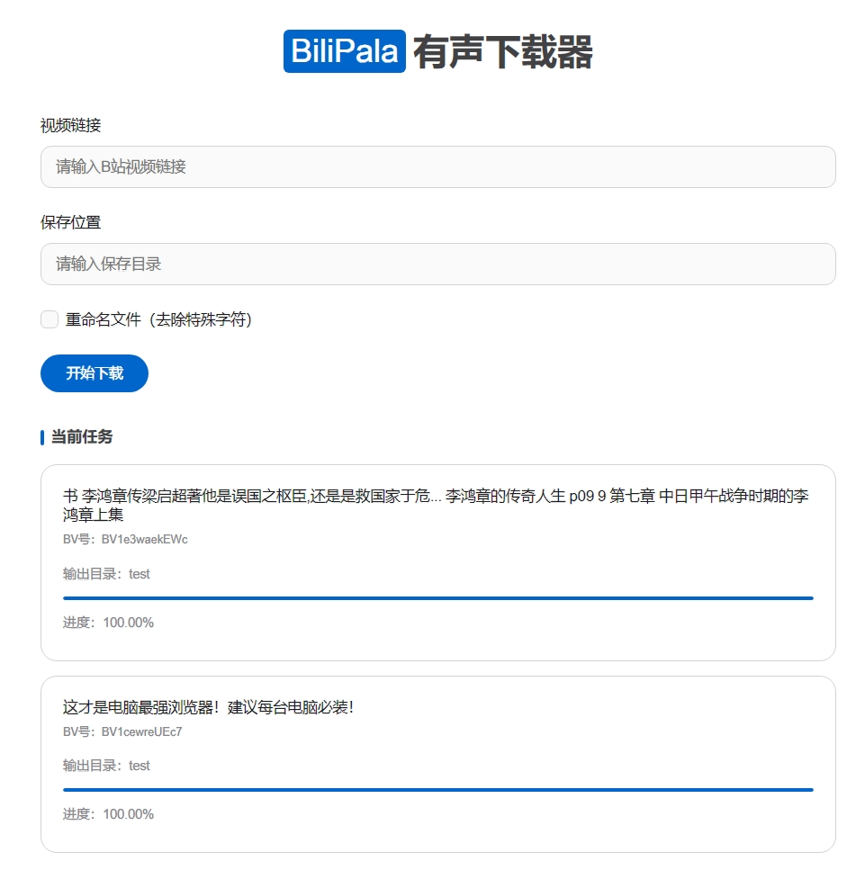

# BiliPala有声下载器

背靠 Bilibili 视频资源，只需要一个播放链接，即可自动化提取该播放列表下所有有声书资源至本地，自动截取封面，直接可用。

## 功能特点

- 支持单个视频和多P视频的音频提取
- 自动提取视频封面并优化
- 支持断点续传
- 自动添加音频元数据
- 美观的Web界面
- 实时下载进度显示
- 支持并发下载和处理
- 音频命名支持关键字屏蔽
- 支持 Docker 部署

## 运行截图



## 环境要求

- Python 3.8+
- FFmpeg
- 操作系统：Windows/Linux/MacOS
- 或者 Docker 环境

## 安装步骤

1. 克隆仓库：
```bash
git clone https://github.com/yourusername/bilibili_audio_downloader.git
cd bilibili_audio_downloader
```

2. 创建并激活虚拟环境：
```bash
python -m venv venv
.\venv\Scripts\activate  # Windows
source venv/bin/activate  # Linux/MacOS
```

3. 安装依赖：
```bash
pip install -r requirements.txt
```

4. 配置环境变量：
```bash
copy .env.example .env  # Windows
cp .env.example .env    # Linux/MacOS
```

5. 编辑 `.env` 文件，配置相关参数：
```env
DOWNLOAD_DIR=downloads
MAX_RETRIES=3
TIMEOUT=30
CONCURRENT_DOWNLOADS=5
AUDIO_QUALITY=192k
```

## 运行应用

```bash
python src/app.py
```

然后在浏览器中访问：`http://localhost:5000`

## Docker 部署

```bash
git clone 本项目至本地电脑
进入 docker 文件夹下
然后 docker compose up -d 即可
```

## 使用说明

1. 在输入框中粘贴B站视频链接（支持普通视频和多P视频）
2. 点击下载按钮开始处理
3. 等待下载和处理完成
4. 在下载目录中查看处理好的音频文件
5. 配置 config/keywords_filter.json 可过滤不需要的命名规则

## 注意事项

- 确保系统已安装 FFmpeg 并添加到环境变量
- 下载目录可在 `.env` 文件中配置
- 音频质量可在 `.env` 文件中调整
- 建议使用虚拟环境运行应用

## 许可证

MIT License